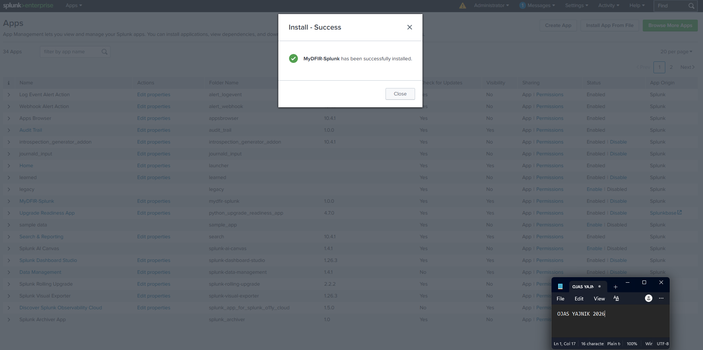
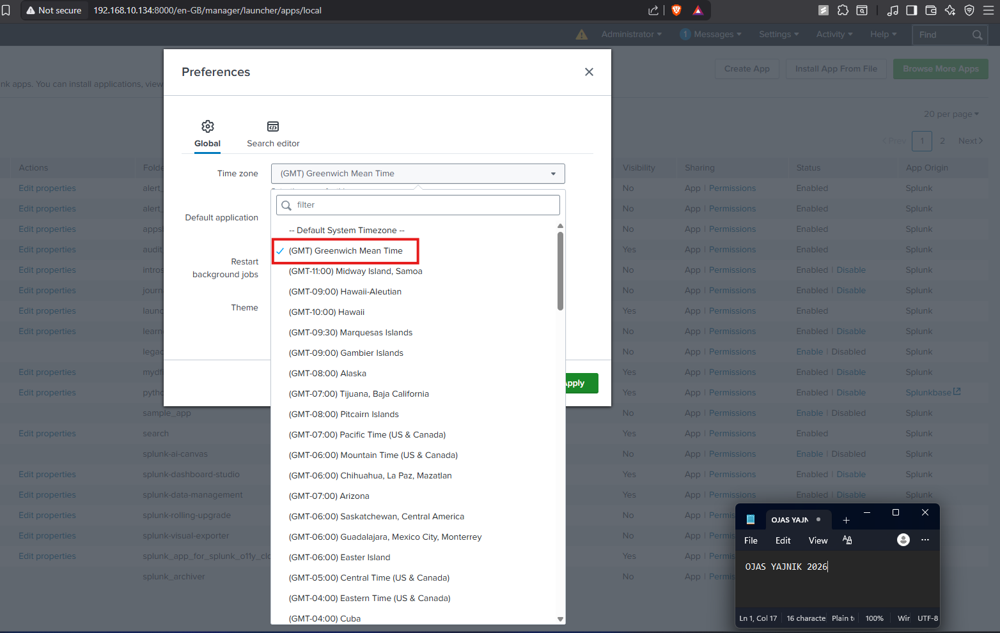
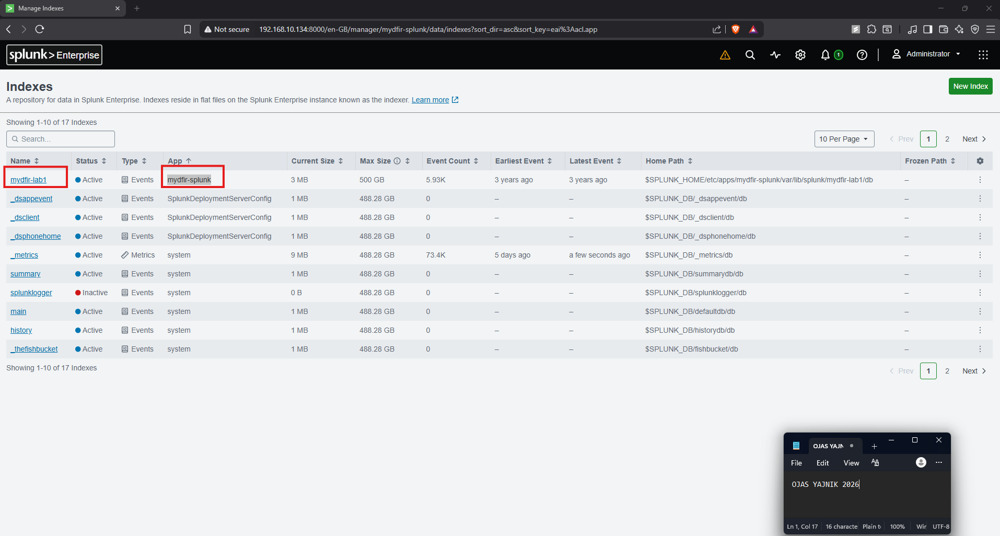

# 00 — Lab Setup

Getting the MyDFIR app installed and the environment ready to search.

## Lab data

| | |
|---|---|
| **Index** | `mydfir-lab1` |
| **Time window** | `2024-01-07 00:00` → `2024-01-08 00:00` |
| **Total events** | 5,931 |
| **Sources** | `auth.log` (Linux SSH), `WinEventLog:Security` (Windows), `linuxvm-netlogs.csv` (network) |

## Steps

1. **Extract the archive.** The lab ships as a password-protected `7-zip`
   archive (`mydfir-splunk.zip`). It must be extracted with **7-zip**
   specifically, or the nested `.tgz` can come out malformed. Integrity was
   verified against the published SHA256 hashes for both the `.zip` and the
   extracted `mydfir-splunk.tgz` before installing.
2. **Install the app.** *Apps → Manage Apps → Install app from file* →
   `mydfir-splunk.tgz`.

   
3. **Set the timezone to GMT.** The dataset is timestamped in GMT, so the
   account timezone is set to *(GMT) Greenwich Mean Time* to keep event times
   honest during analysis.

   
4. **Confirm the index.** `mydfir-lab1` shows Active with ~5.93K events under
   the `mydfir-splunk` app.

   

