# 01 — Search Fundamentals

Getting fluent in SPL and learning to think like a SOC analyst inside Splunk.
Full SPL for this module: [`queries/01-search-fundamentals.spl`](../queries/01-search-fundamentals.spl).

## Time range

Every search is bounded to the dataset window using a **Date Range** of
`07/01/2024 00:00:00` → `08/01/2024 00:00:00`. Getting the time picker right is
the difference between "no results" and the full 5,931-event picture.

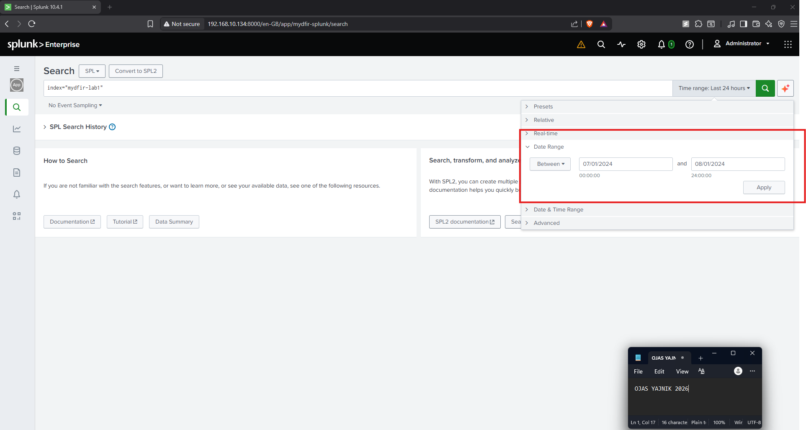

## Search modes

Splunk offers three search modes, and knowing when to use each matters for speed
vs. detail:

| Mode | What it does | Use when |
|------|--------------|----------|
| **Smart** | Balances field discovery and speed (default) | General searching |
| **Fast** | Minimal field extraction, fastest | You know exactly what you need |
| **Verbose** | Extracts every field it can | Deep-diving a small result set |

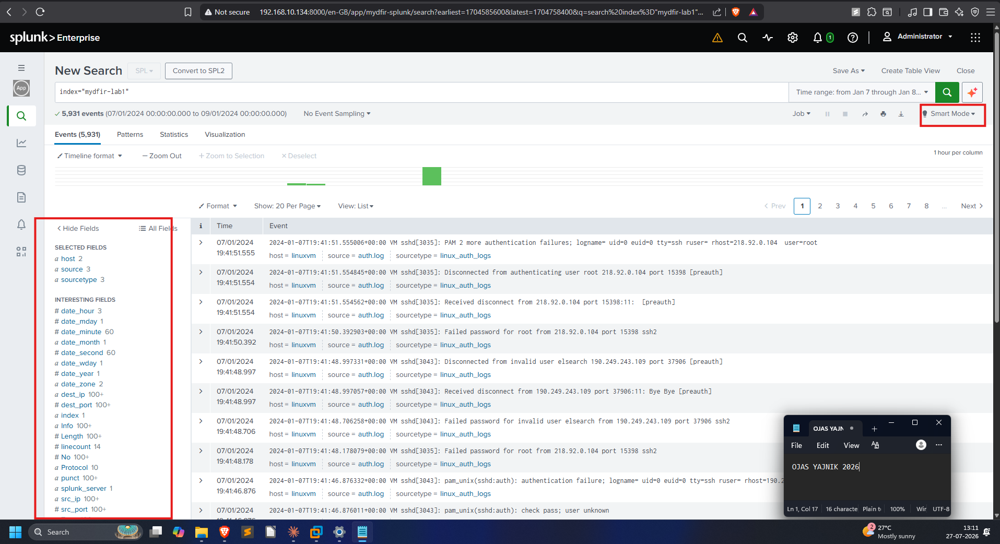
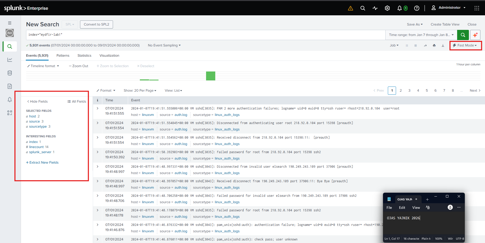
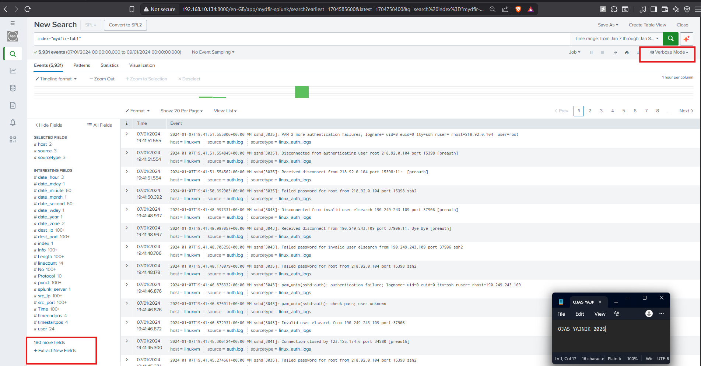

## The case-sensitivity rule (the one that bites everyone)

**Field _names_ are case-sensitive. Field _values_ are case-insensitive.**

Searching `Dest_ip="178.128.237.149"` (capital D) returns **0 events** — there is
no field called `Dest_ip`:

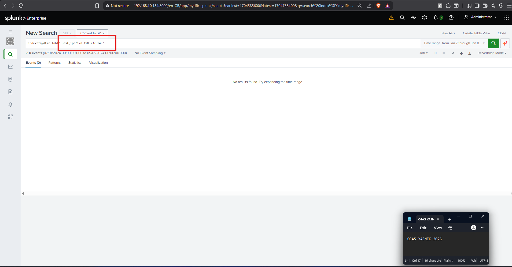

Fix the field name to lowercase `dest_ip` and the same search returns **2,033
events**:

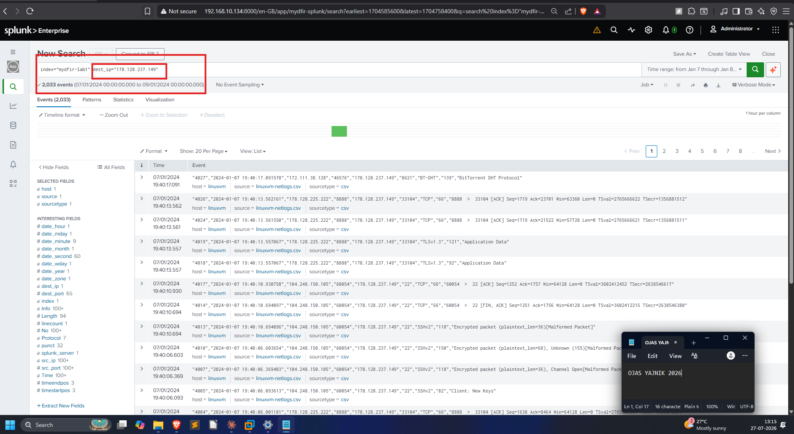

But the *value* doesn't care about case — `sourcetype=Csv` and `sourcetype=csv`
return the same events:

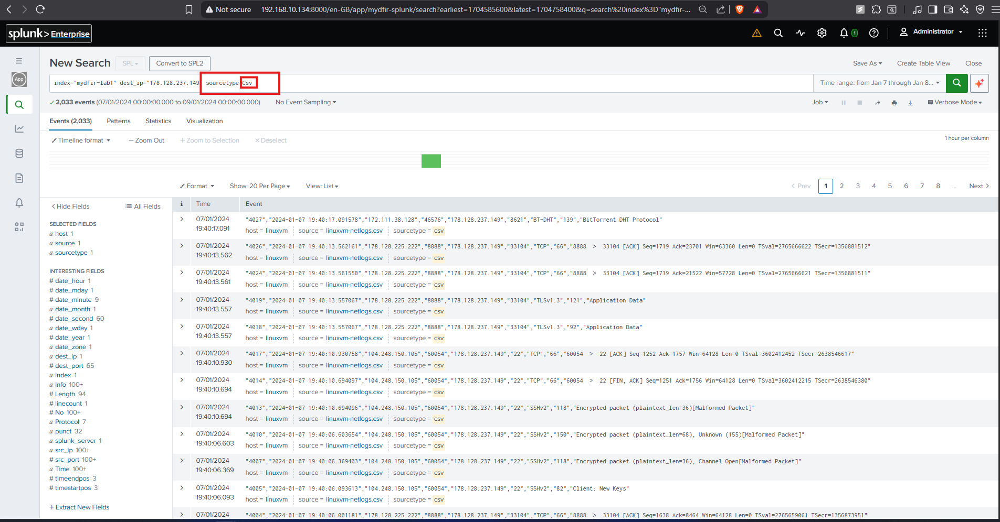
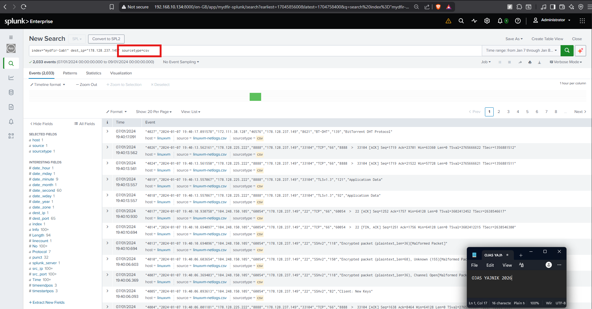

## Reading events and pivoting

Expanding an event shows its field/value pairs — the raw material for building
searches:

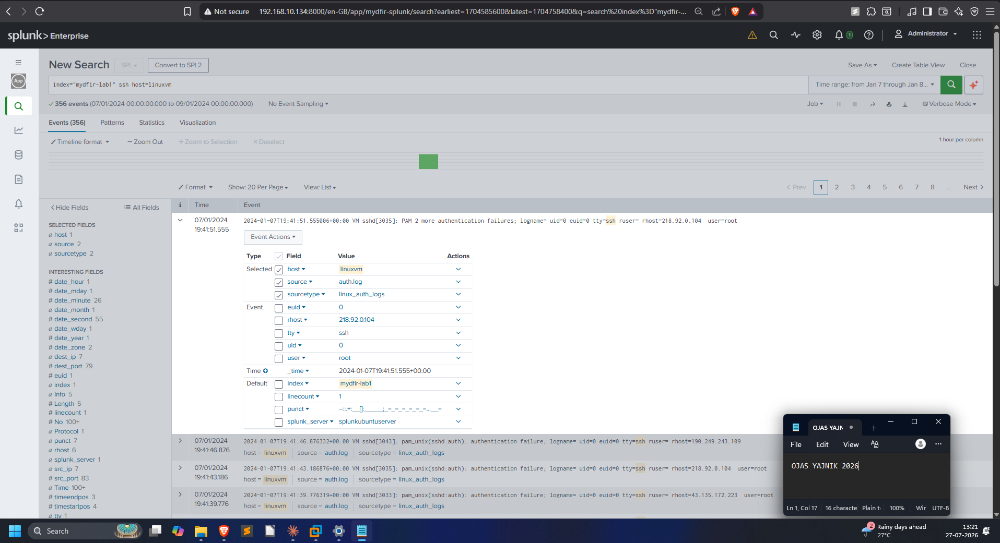

The same logical thing (an IP) can appear under multiple field names
(`src_ip`, `dest_ip`, etc.), so it pays to check what's actually populated:

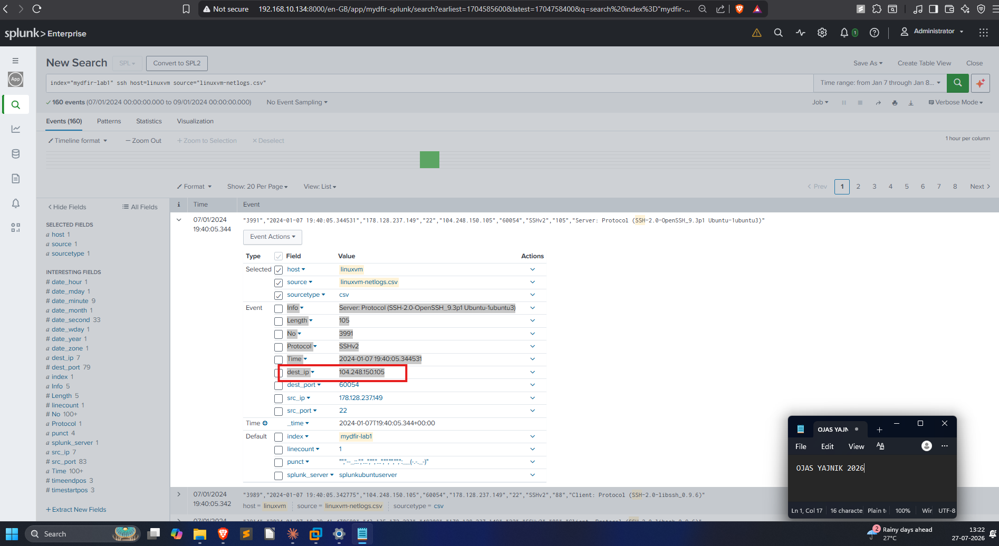

Splunk can also pivot to **nearby events** (±N seconds/minutes) around a chosen
event — invaluable for reconstructing what happened right before and after
something suspicious:

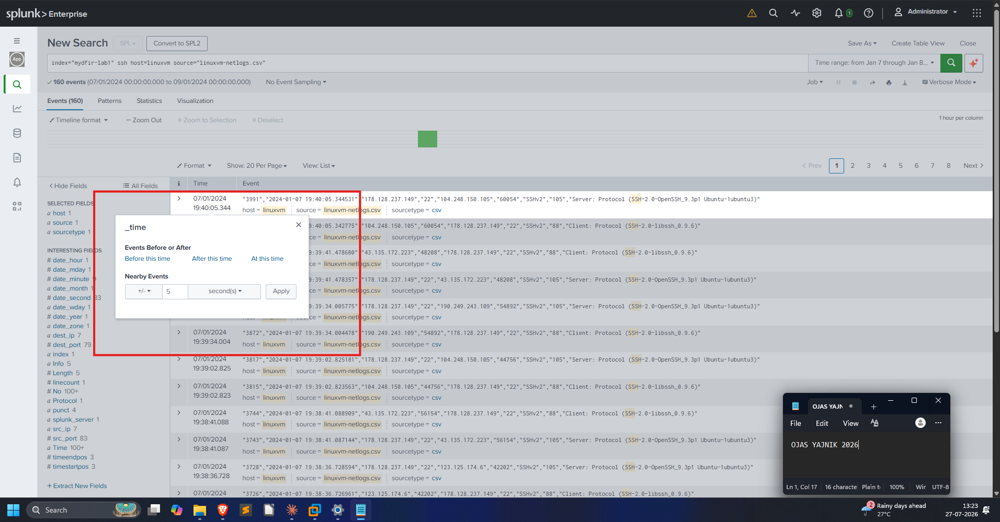

## Transforming commands

`stats` aggregates — here, counting connections between a specific source and
destination (112 events for that pair):

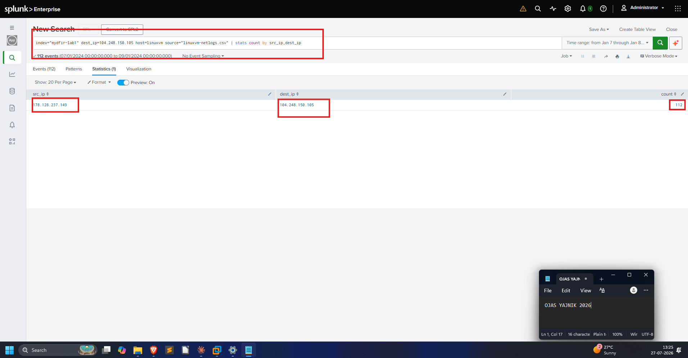

`table` shapes results into named columns. Note the `Src_ip` column comes back
**empty** — a live demonstration of the case rule above (the real field is
`src_ip`):

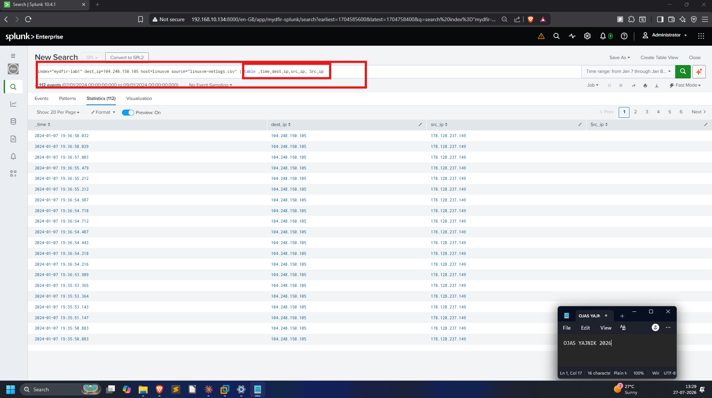
