# 02 — SSH Activity Dashboard

Turning `auth.log` into an at-a-glance view of who is attacking the SSH server,
who got in, and from where. Full SPL:
[`queries/02-ssh-activity-dashboard.spl`](../queries/02-ssh-activity-dashboard.spl).

The finished dashboard has five panels:

| Panel | Visualisation | Answers |
|-------|---------------|---------|
| Top Failed Account | Single Value | Which account is being targeted? |
| Top Source IP | Single Value | Where are the failures coming from? |
| Failed Attempts by User | Statistics Table | Full breakdown of failed logins |
| Successful Logins by User | Statistics Table (geo) | Who actually got in, and from what country? |
| Heatmap network activity | Choropleth Map | Global distribution of source IPs |

## Building a panel (Top Failed Account)

Filter to failed SSH logins, then `top` the `user` field. `root` dominates at
**84.5%** — a textbook brute-force signature.

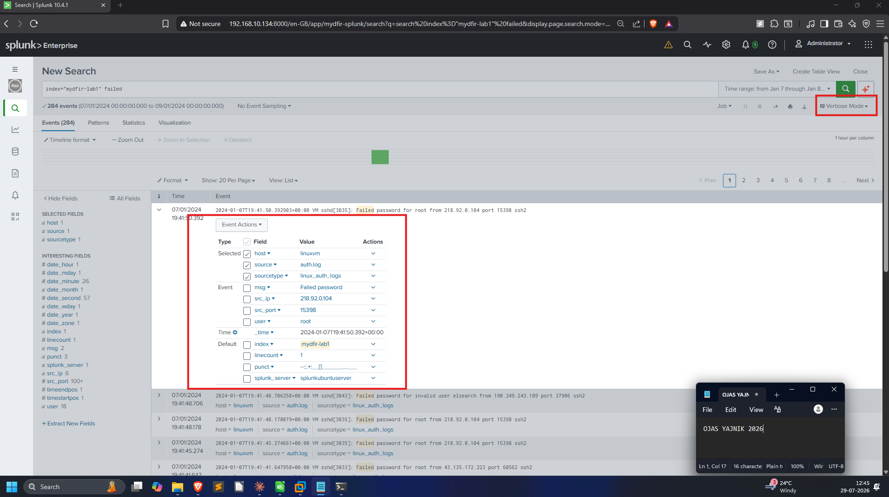
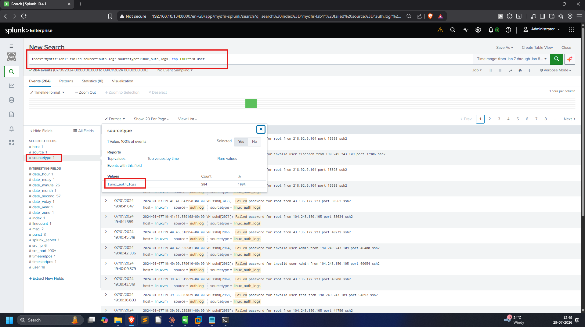

Switch the visualisation to **Single Value** and save it as the first panel of a
new dashboard called **SSH Activity**.

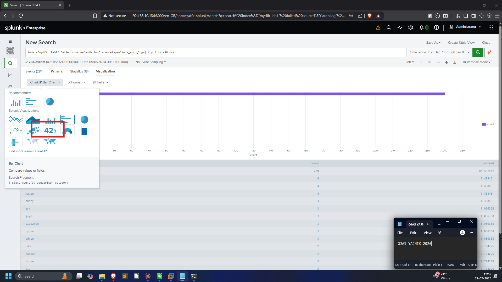
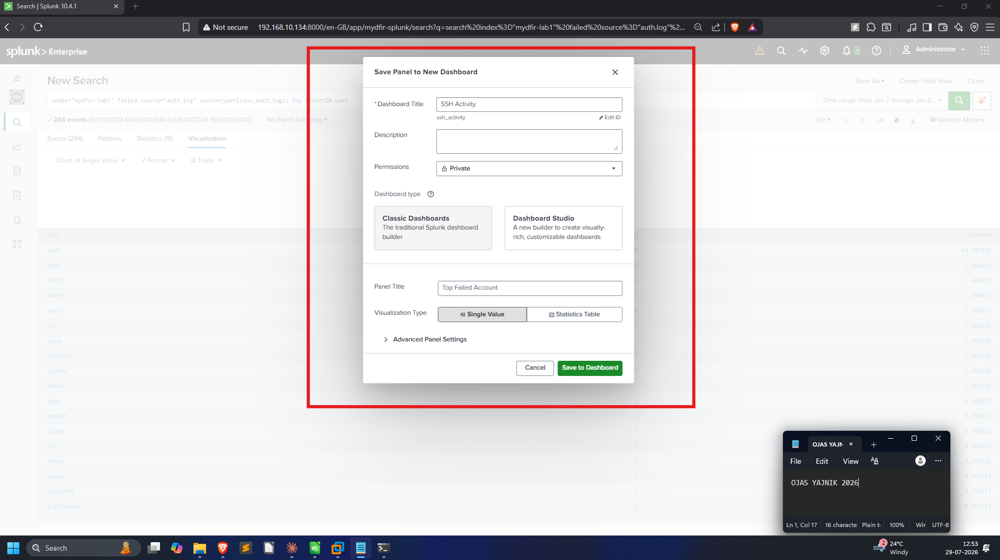

## Top Source IP

Same base search, `top` on `src_ip` → **178.128.225.222** is the loudest source.
Saved as a Single Value panel.

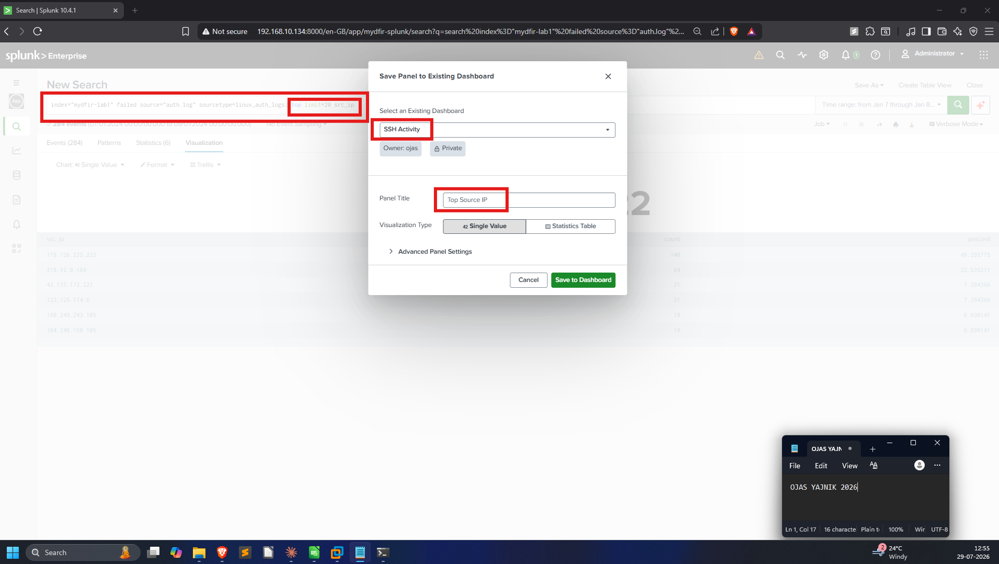

## Failed Attempts by User

`stats count by user` gives the full ranked table behind the single-value tile,
saved as a Statistics Table panel.

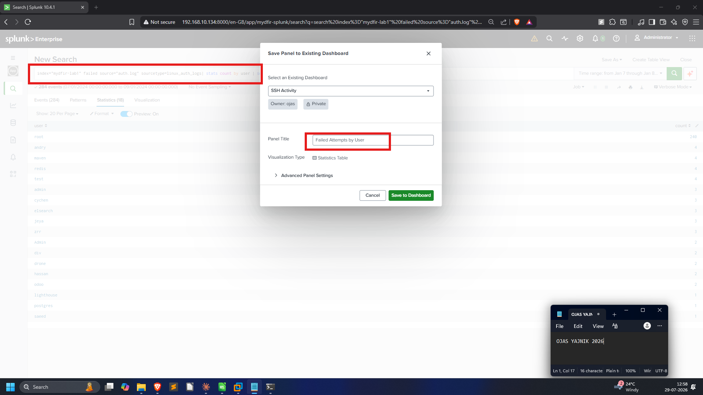

## Successful Logins by User (with geo-IP)

This is the important one. Filtering to `msg="Accepted password"` and enriching
with `iplocation src_ip` reveals successful `root` logins from Canada **and one
from Greenland** (`91.90.120.159`) — a strong "impossible travel" / unusual-geo
signal for a valid-accounts compromise.

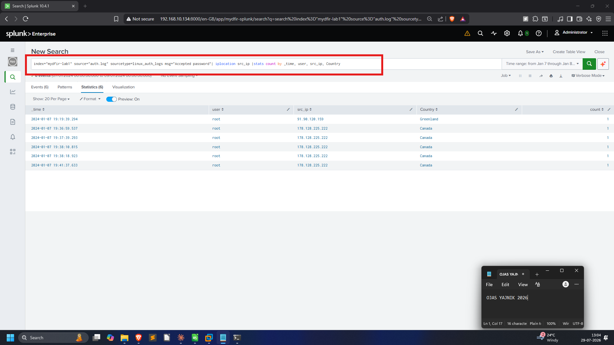
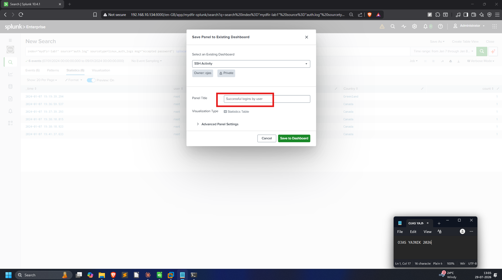

## Heatmap of all external activity

`iplocation` + `geom geo_countries` maps every source country onto world
polygons. The colour mode is set to **Categorical** so distinct countries stand
apart rather than shading a single gradient.

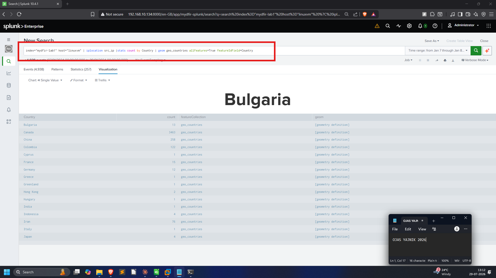
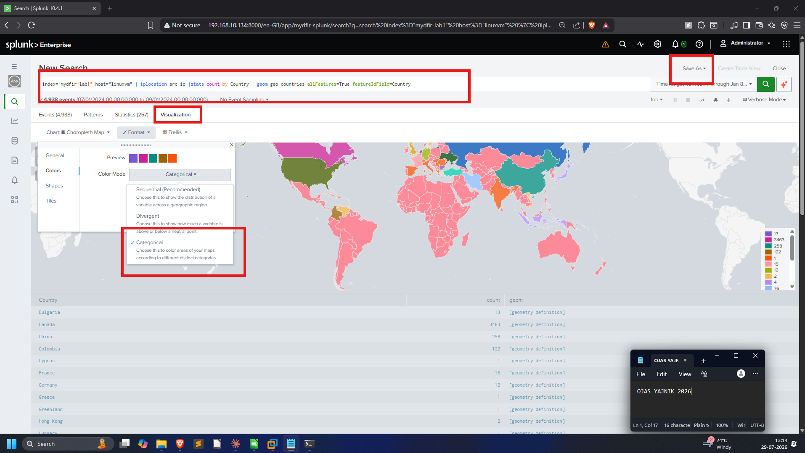

## Finished dashboard

Built first in the default light theme, then finalised in dark mode:

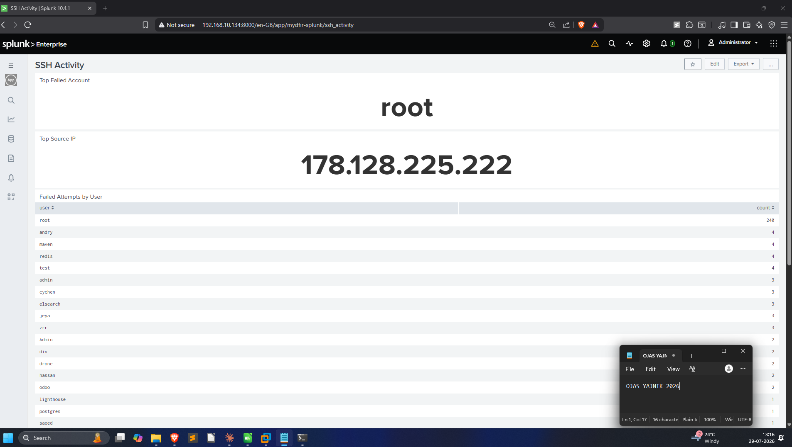
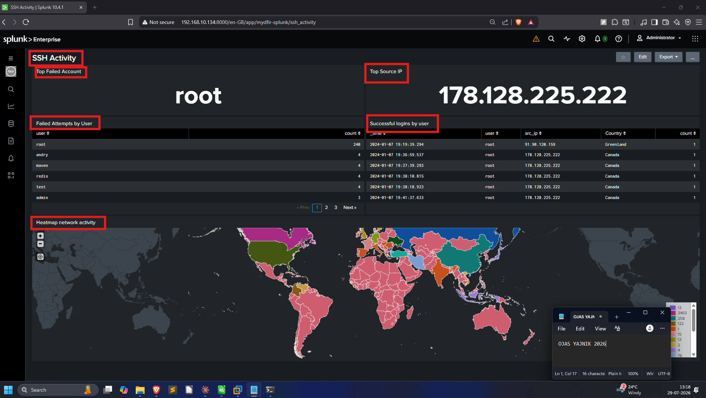

## Day 26 accountability prompt

> *What's your experience when it comes to building dashboards? Was this your first time?*

Building Splunk dashboards from raw auth logs was new to me. The biggest
takeaway was that a good panel starts from an investigative question ("who is
being targeted?"), not from a chart type — the visualisation is chosen last, to
fit the answer.
