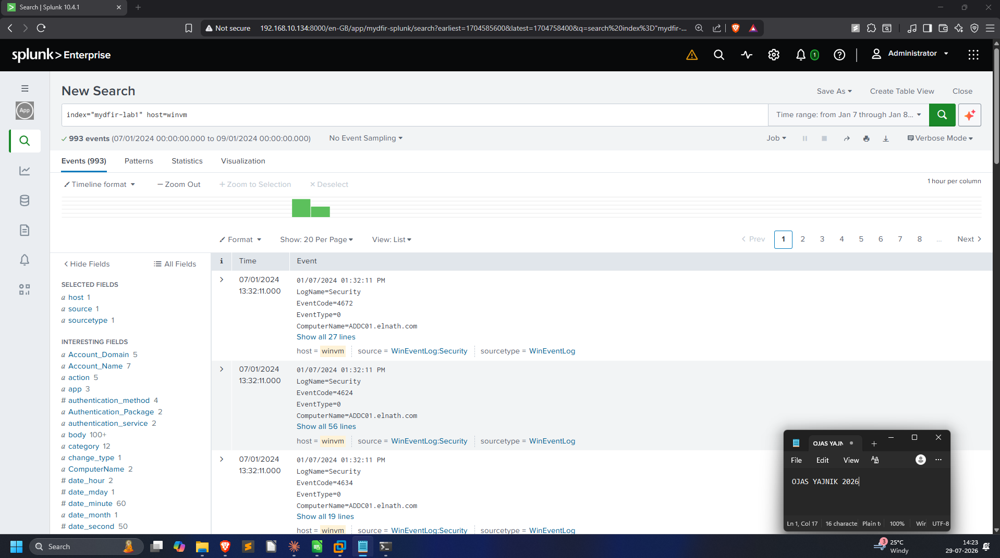
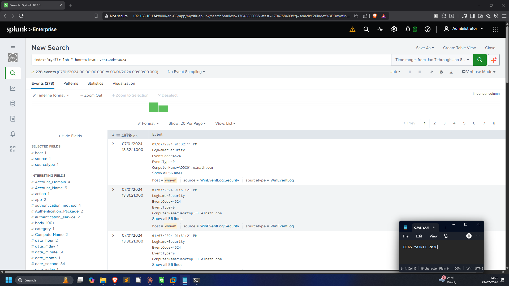
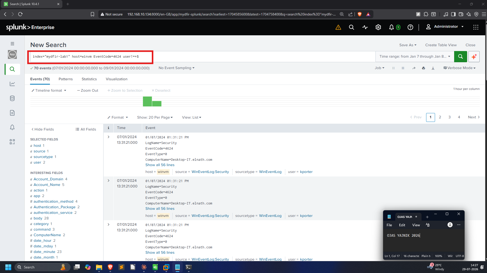
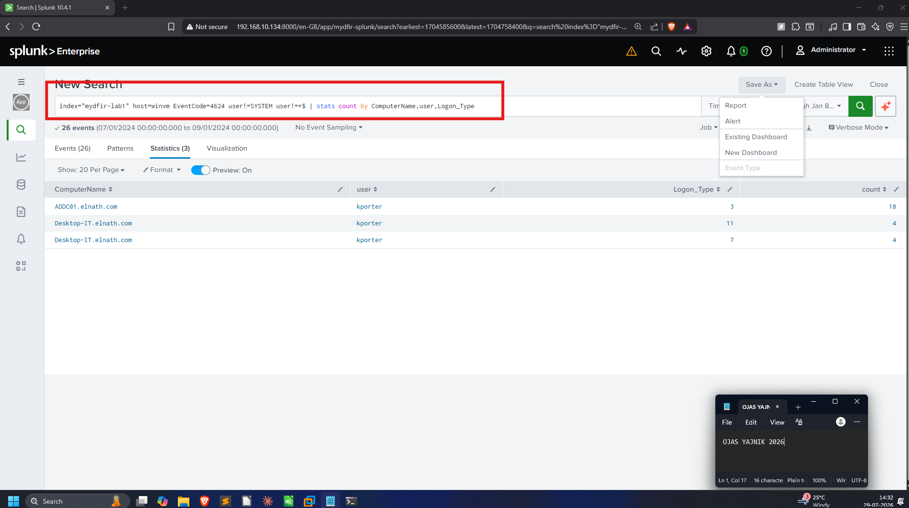
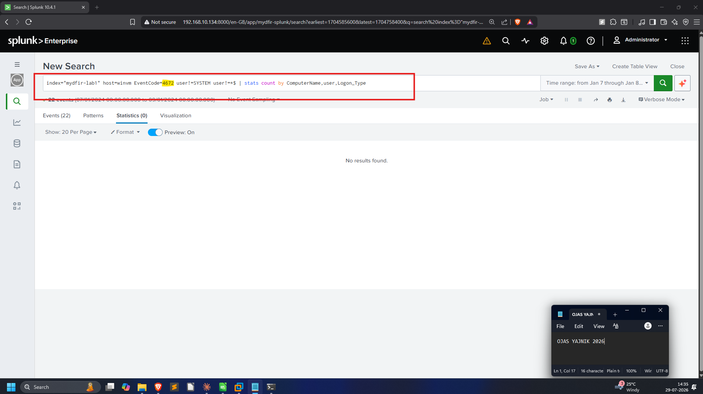
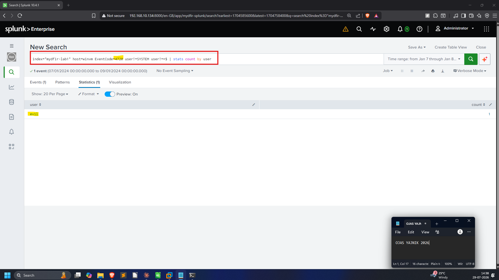
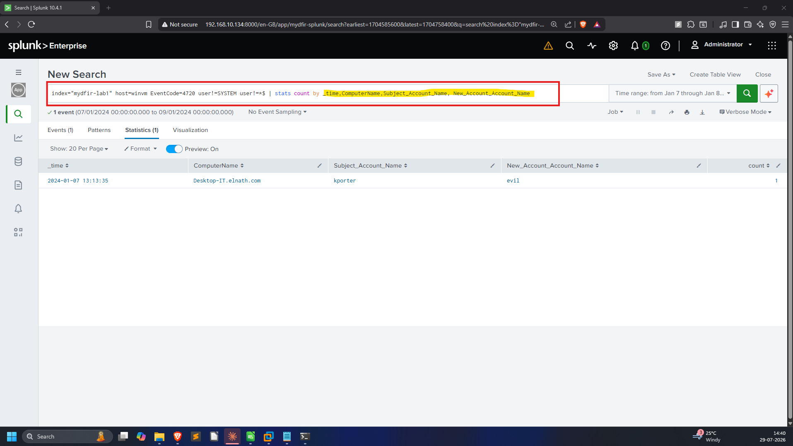
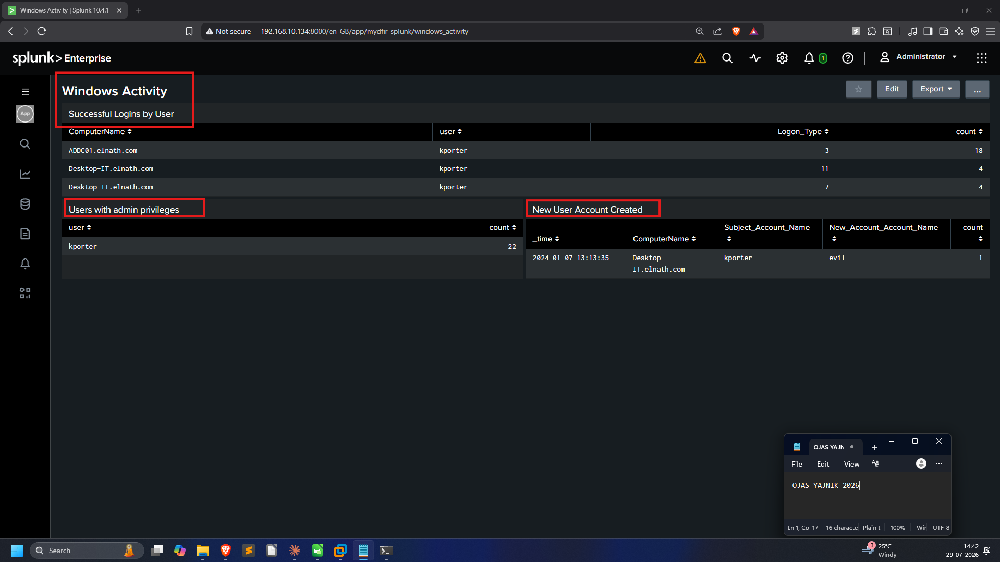

# 03 — Windows Activity Dashboard

Turning `WinEventLog:Security` into a view of logons, privileged activity, and
account creation. Full SPL:
[`queries/03-windows-activity-dashboard.spl`](../queries/03-windows-activity-dashboard.spl).

**Event IDs that matter here:**

| Event ID | Meaning |
|----------|---------|
| 4624 | An account successfully logged on |
| 4672 | Special privileges assigned to a new logon (admin-equivalent) |
| 4720 | A user account was created |

## Scoping the data

Start broad, then narrow. `host=winvm` returns 993 events; adding
`EventCode=4624` narrows to 278 successful logons; excluding machine accounts
(`user!=*$`, the trailing `$`) drops it to 70 human logons.





## Panel 1 — Successful Logins by User

Excluding `SYSTEM` and machine accounts, then `stats count by ComputerName, user,
Logon_Type`. `kporter` is the human account doing the logging in.



## Gotcha: why a panel returned zero rows

For **Users with Admin Privileges** I first reused the same `by` clause from
Panel 1 on Event **4672**:

```spl
index="mydfir-lab1" host=winvm EventCode=4672 user!=SYSTEM user!=*$
| stats count by ComputerName,user,Logon_Type      <-- returns Statistics(0)
```

Despite the base search returning **22 events**, the stats table came back
**empty**. The cause: `Logon_Type` is **not populated on 4672 events**, so
grouping by it collapses every row.



**Fix** — group only by fields that exist on the event:

```spl
index="mydfir-lab1" host=winvm EventCode=4672 user!=SYSTEM user!=*$
| stats count by user                              <-- kporter (22)
```

Small bug, but a useful reminder: an empty `stats` result usually means a field
in the `by` clause doesn't exist on those events, not that there's no data.

## Panel 3 — New User Account Created

Event **4720** on this host produces a single, very on-the-nose result: the
account **`evil`**, created by `kporter` on `Desktop-IT.elnath.com`. This is the
persistence step of the intrusion story.




## Finished dashboard


