# 04 — Detections (Scheduled Alerts)

Moving from "looking at data" to "being told when something happens." Full SPL:
[`queries/04-alerts.spl`](../queries/04-alerts.spl).

**Naming convention** used throughout: `Category - MITRE ATT&CK ID - Activity`,
e.g. `Network- T1078- Successful SSH Authentication`. Consistent names make an
alerts backlog searchable and self-documenting.

---

## Walkthrough alert — Successful SSH Authentication (T1078)

**Goal:** fire whenever someone successfully authenticates to the SSH server, so
an analyst can OSINT the source IP and pivot ±5 minutes for indicators.

Base search enriches the successful login with `iplocation`:

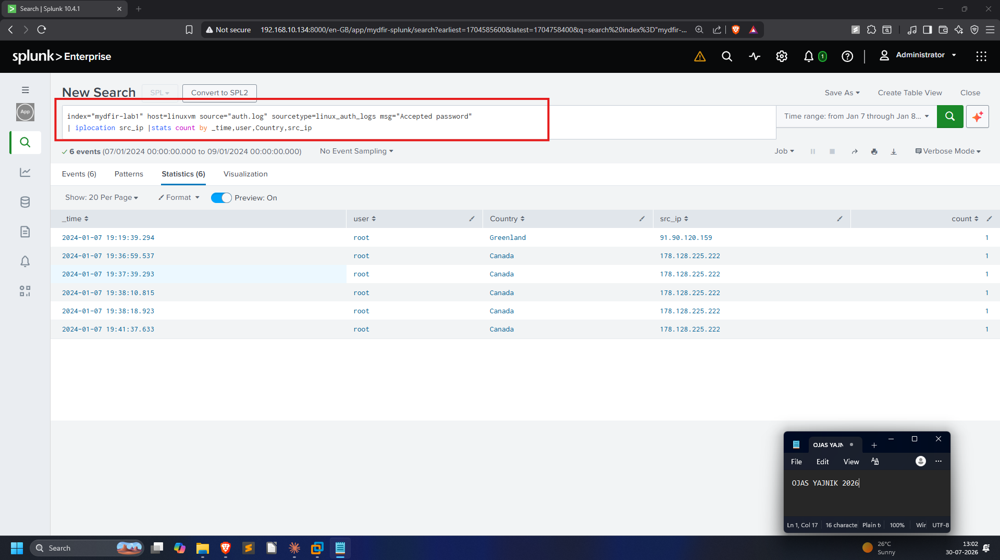

The MITRE technique (**T1078 – Valid Accounts**) and the cron schedule were
looked up while building it — `*/15 * * * *` = every 15 minutes, confirmed on
crontab.guru:

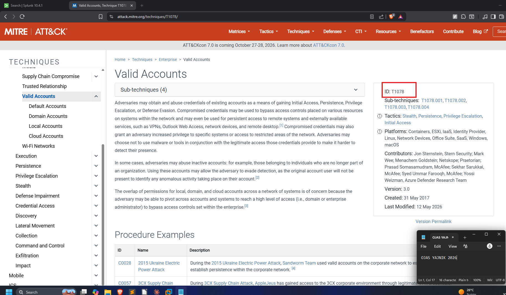
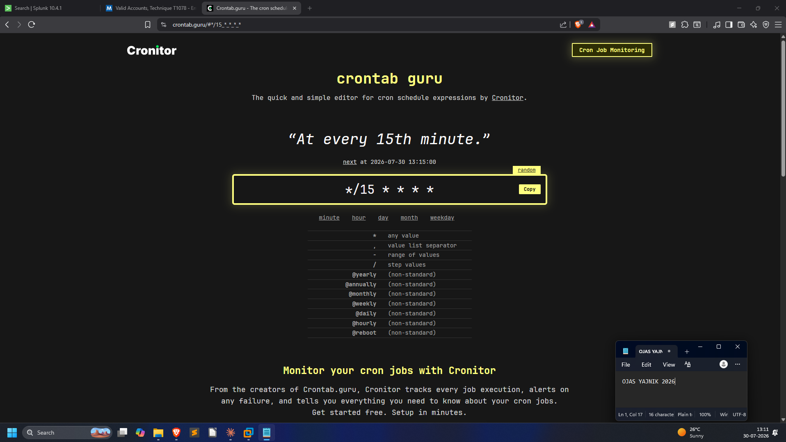

**Alert config:**

| Setting | Value |
|---------|-------|
| Permissions | Shared in App |
| Alert type | Scheduled → Run on Cron Schedule `*/15 * * * *` |
| Trigger | Number of Results **is greater than 0** |
| Action | Add to Triggered Alerts, **Severity: Medium** |

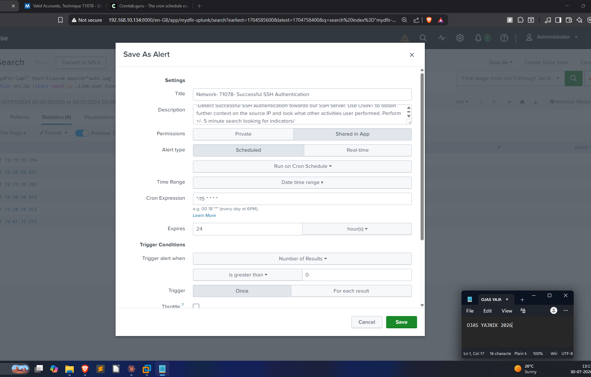
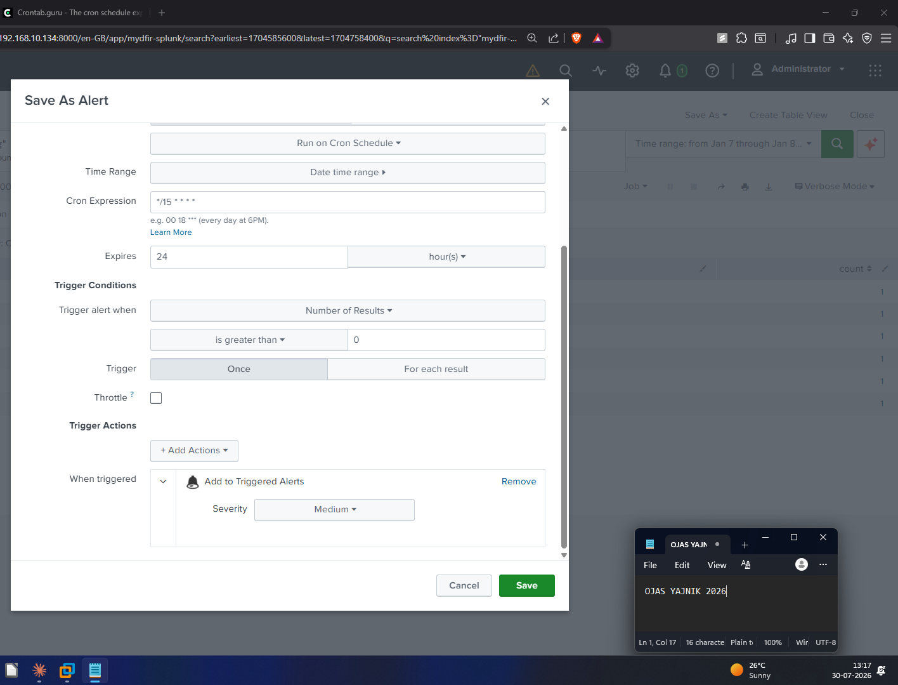

Permissions set to Everyone (read) / power+admin (write) so the whole app can
see it:

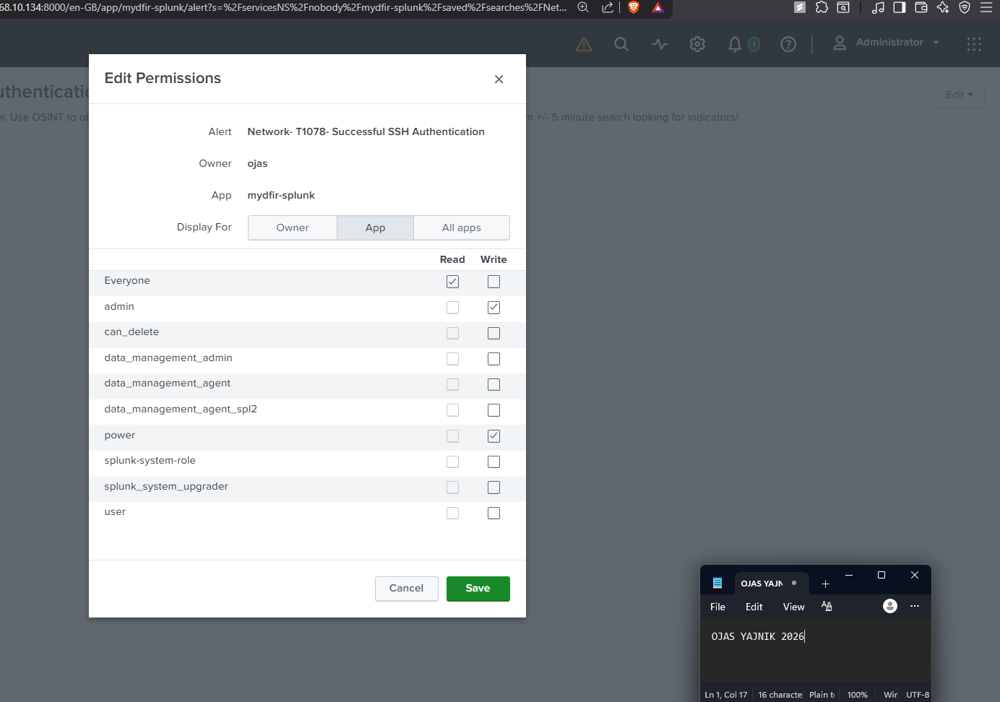
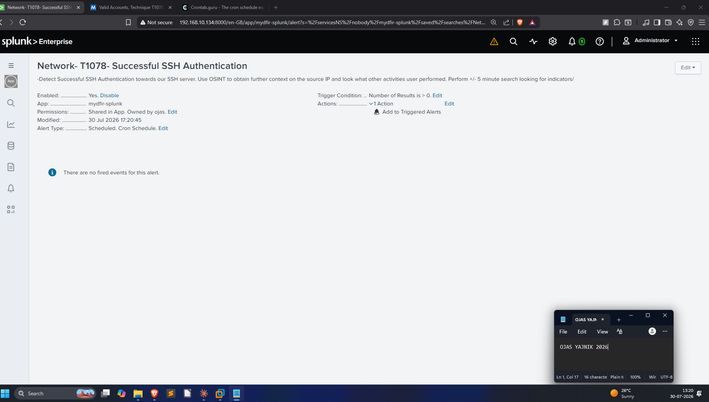

**Verifying it works.** The Triggered Alerts page is where fired alerts land.
Testing the search against a live "Last 15 minutes" window correctly returns 0
results (the lab data is from Jan 2024) — proving the search and trigger logic
behave, without a false positive:

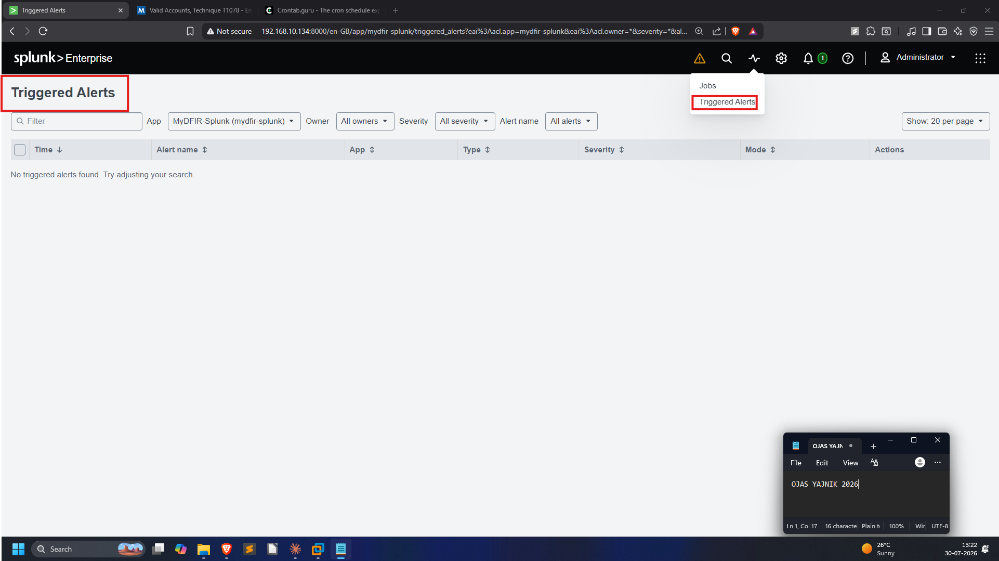
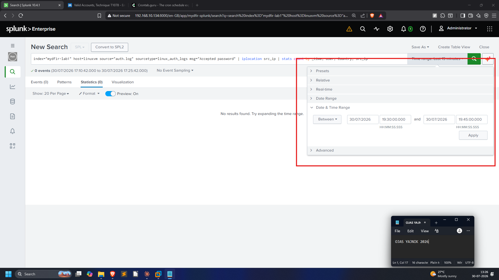
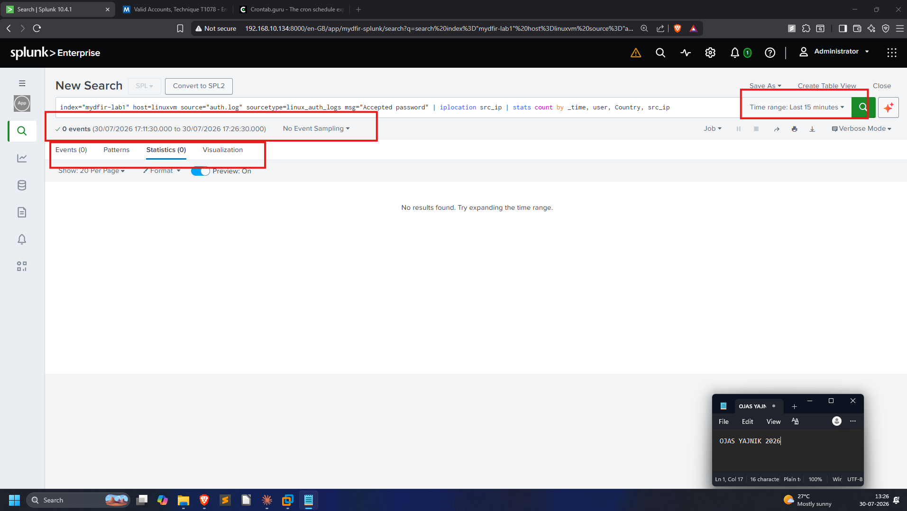

---

## Scenario alert — New User Account Created (T1136)

**Prompt:** *"Create a MEDIUM severity alert that fires if a new user account is
created. Run it every hour and send it to the Triggered Alerts page. Follow the
`Endpoint - <MITRE ID> - <Activity>` naming convention."*

Base search is the Event 4720 detection from the Windows dashboard:

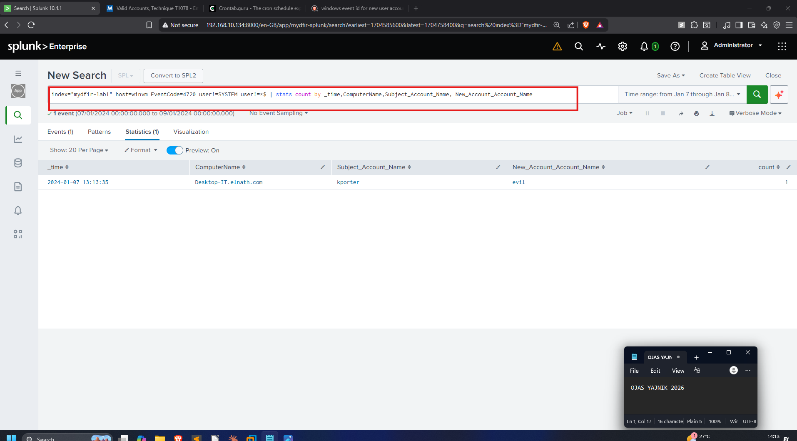

**Alert config:**

| Setting | Value |
|---------|-------|
| Title | `Endpoint-T1136- New User Account Created` |
| Description | *Detects a newly created user account. Review both activities performed by the newly created user and source user for potential compromise.* |
| Permissions | Shared in App |
| Alert type | Scheduled → Run every hour, at 0 minutes past the hour |
| Trigger | Number of Results **is greater than 0** |
| Action | Add to Triggered Alerts, **Severity: Medium** |

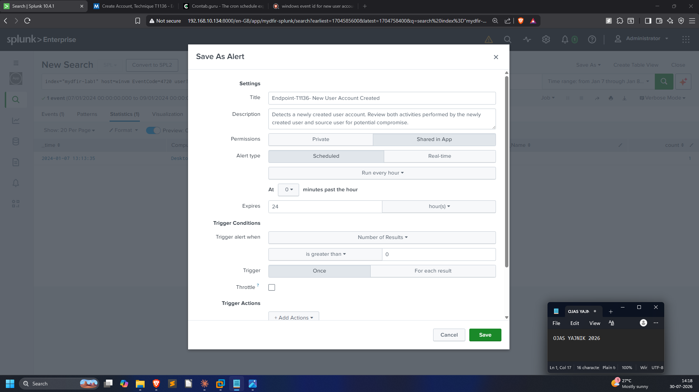
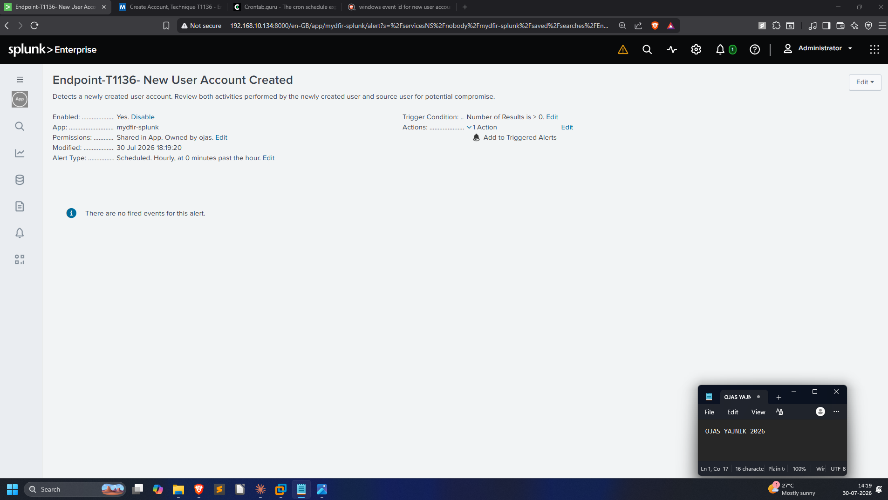

## Day 27 accountability prompt

> *What alert and report did you create in Splunk today, and who would benefit
> from reading it in a real SOC?*

Created the T1078 SSH-auth alert and the T1136 new-account alert. In a real SOC
the SSH-auth alert would feed the tier-1 triage queue (fast OSINT + pivot on the
source IP), while the new-account alert is high-signal for tier-2 / IR — account
creation outside a change window is a classic persistence indicator worth an
immediate look.
