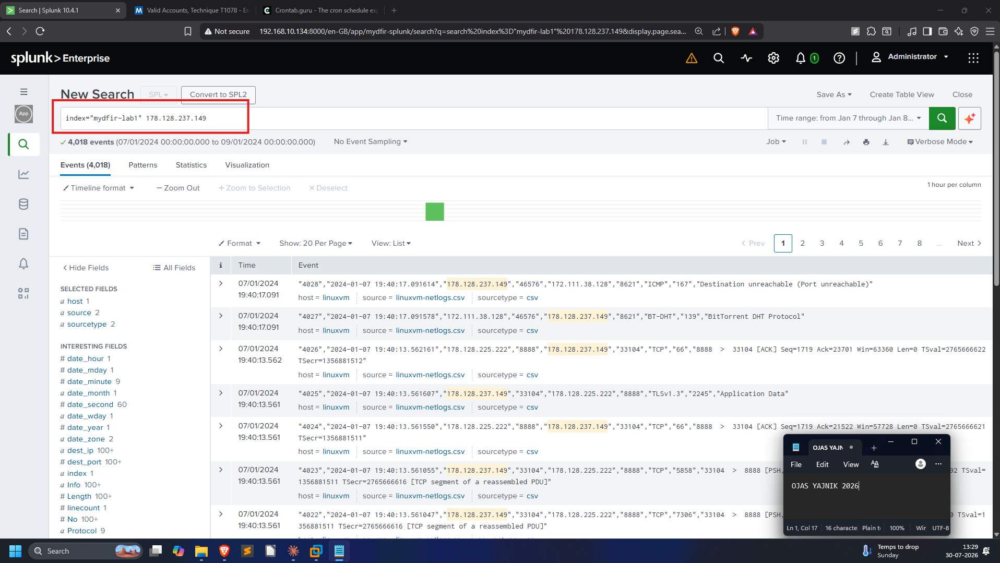
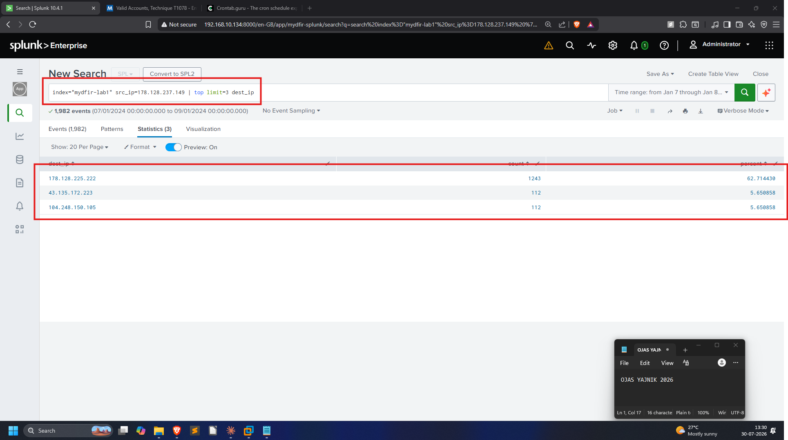
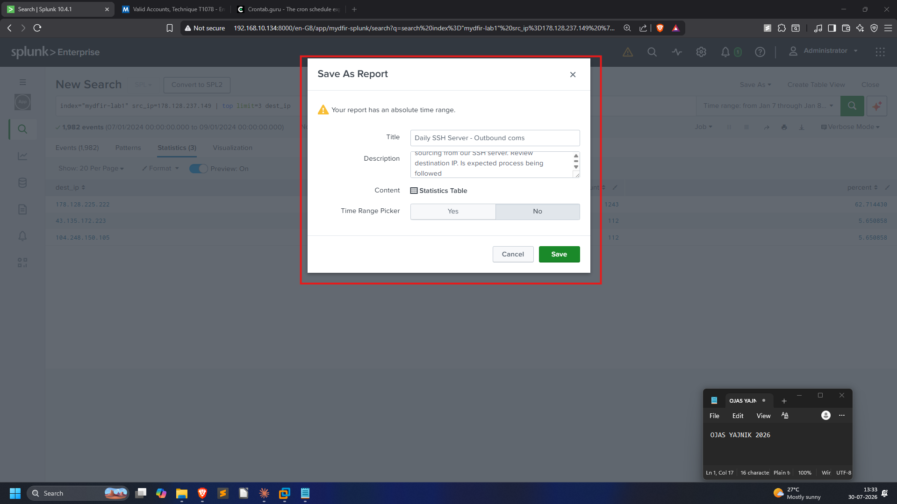
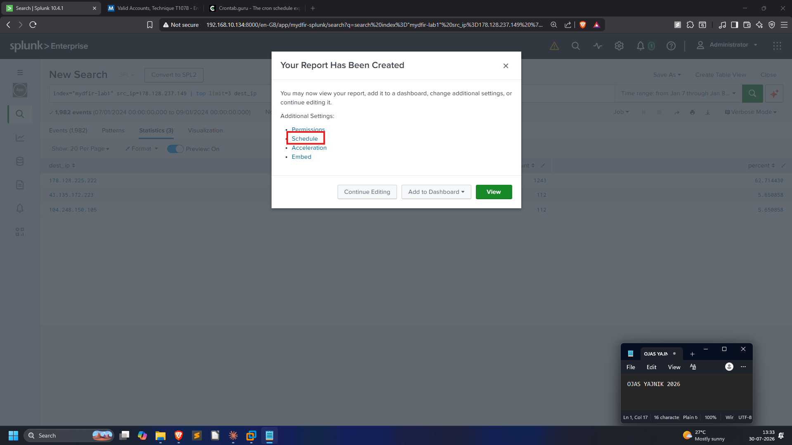
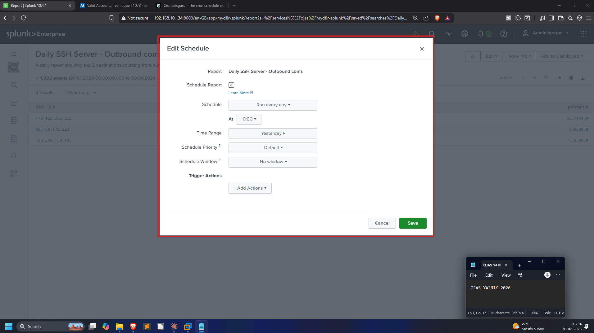
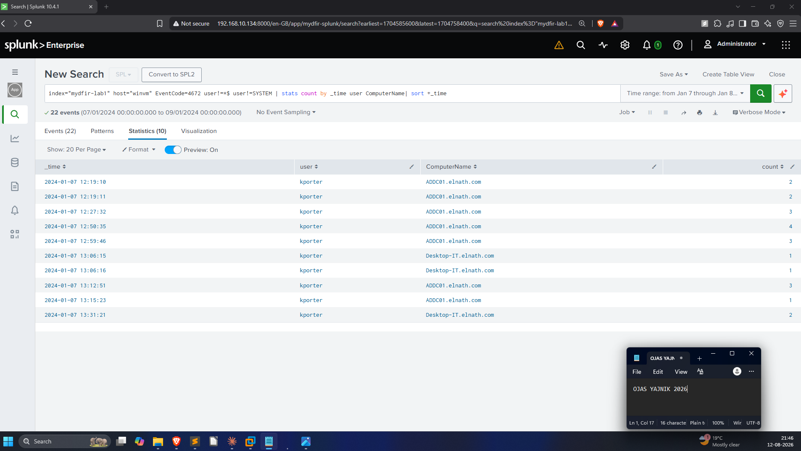
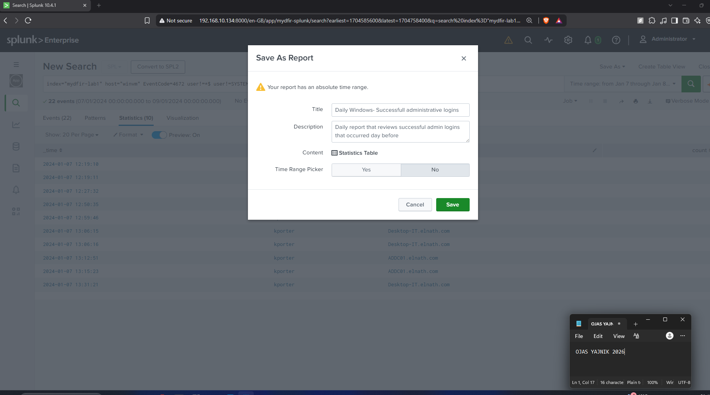
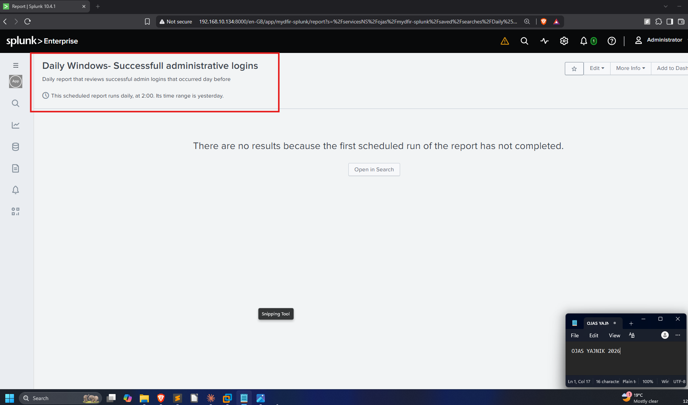

# 05 — Reports (Scheduled Reports)

Reports document trends over time and get delivered on a cadence to teams or
leadership. Full SPL: [`queries/05-reports.spl`](../queries/05-reports.spl).

**Alerts vs. reports, in one line:** an alert tells you *something happened right
now*; a report gives you *a recurring, scheduled summary* to review.

---

## Walkthrough report — Daily SSH Server Outbound Comms

**Goal:** a daily report of the **top 3 destination IPs** that the SSH server
(`178.128.237.149`) is talking to — useful for spotting the server reaching out
somewhere it shouldn't.

Broad search on the IP first (4,018 events), then reduce to the top 3
destinations:




Top destinations: `178.128.225.222` (62.7%), `43.135.172.223` (5.65%),
`104.248.150.105` (5.65%).

**Save as report** → schedule **daily at 0:00**, time range **Yesterday**:





---

## Scenario report — Daily Windows Successful Admin Logins

**Prompt:** *"Create a daily report named `Daily - Windows - Successful
Administrative Logins`… runs every day at 2 AM over 'Yesterday', querying all
Windows logins with administrative privileges. Filter out SYSTEM and computer
accounts. Include time, user & computer, sorted earliest-first."*

This is the **corrected** 4672 query (see the
[Windows dashboard bug write-up](03-windows-dashboard.md#gotcha-why-a-panel-returned-zero-rows))
— grouping by fields that actually exist on the event, and `sort +_time` for
earliest-first:

```spl
index="mydfir-lab1" host="winvm" EventCode=4672 user!=*$ user!=SYSTEM
| stats count by _time user ComputerName
| sort +_time
```



**Save as report** → schedule **daily at 2:00**, time range **Yesterday**:




The scheduled report page confirms the cadence ("runs daily, at 2:00, time range
is yesterday"). It shows no rows yet simply because the first scheduled run
hasn't fired — expected behaviour for a newly scheduled report:


