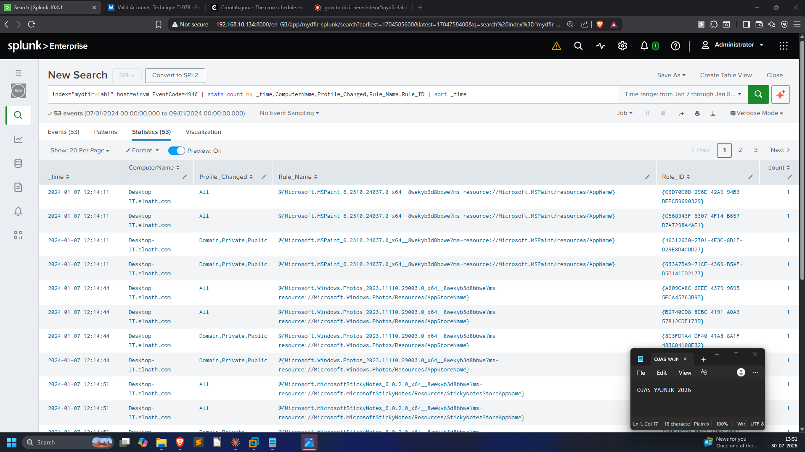
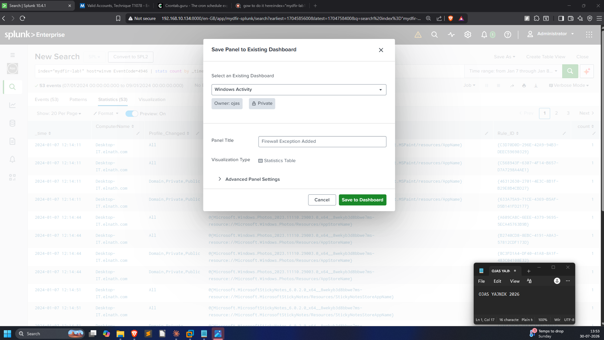
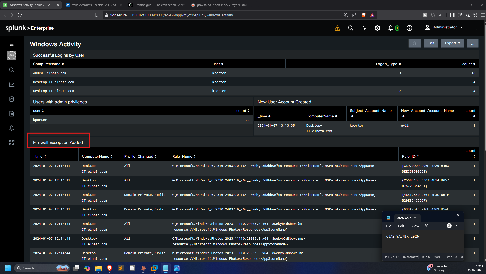

# 06 — Scenario: Firewall Exception Added Panel

**Prompt:** *"You received an email from your SOC manager asking you to add
another panel onto the `Windows Activity` dashboard. They want to see any changes
to the Windows Firewall Exception List — specifically rules that were **added**.
Include the time, Computer, Profile Changed, Rule Name and Rule ID, sorted
earliest-first. Name the panel `Firewall Exception Added`."*

Full SPL:
[`queries/06-scenario-firewall-panel.spl`](../queries/06-scenario-firewall-panel.spl).

## Approach

The relevant Windows Security event is **4946 — "A rule was added to the Windows
Firewall exception list."** Grouping by the requested fields and sorting on
`_time` gives exactly the columns the manager asked for:

```spl
index="mydfir-lab1" host=winvm EventCode=4946
| stats count by _time,ComputerName,Profile_Changed,Rule_Name,Rule_ID
| sort _time
```

53 events, earliest-first:



## Saving it to the existing dashboard

Rather than a new dashboard, the panel is saved onto the existing **Windows
Activity** dashboard with the exact requested title:



## Result

The `Firewall Exception Added` panel now sits alongside the logon, admin, and
account-creation panels — completing the picture: the same intrusion that created
the `evil` account is also punching holes in the host firewall (a defense-evasion
step).


